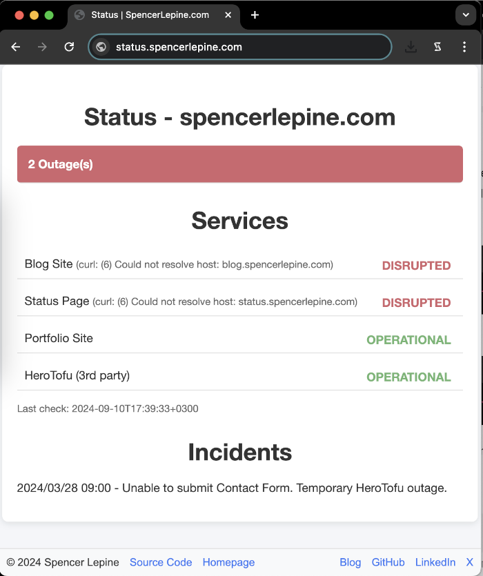
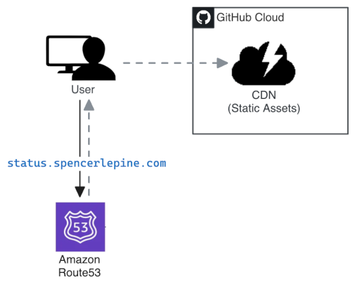

# [status.spencerlepine.com](https://status.spencerlepine.com)

Uptime monitor and status page for my developer portfolio site ([spencerlepine.com](https://spencerlepine.com)).

## Architecture

## How It Works

GitHub Actions workflows handle site monitoring, and the status page is hosted on GitHub Pages.

- Every 12 hours, a GitHub Actions workflow, triggered by a cron job, runs the status checks.
- Every 12 hours, the static site is deployed to GitHub Pages with the latest report
- Weekly, another GitHub Actions workflow, also triggered by a cron job, runs the Contact Form Canary check.

## Related

- repository: [spencerlepine/spencerlepine.com](https://github.com/spencerlepine/spencerlepine.com)
- repository: [spencerlepine/blog.spencerlepine.com](https://github.com/spencerlepine/blog.spencerlepine.com)
- repository: [spencerlepine/status.spencerlepine.com](https://github.com/spencerlepine/status.spencerlepine.com)

## License

This project is licensed under the MIT License. See [LICENSE](./LICENSE) for details.

Includes code from [Tinystatus](https://github.com/username/tinystatus), licensed under the MIT License.
